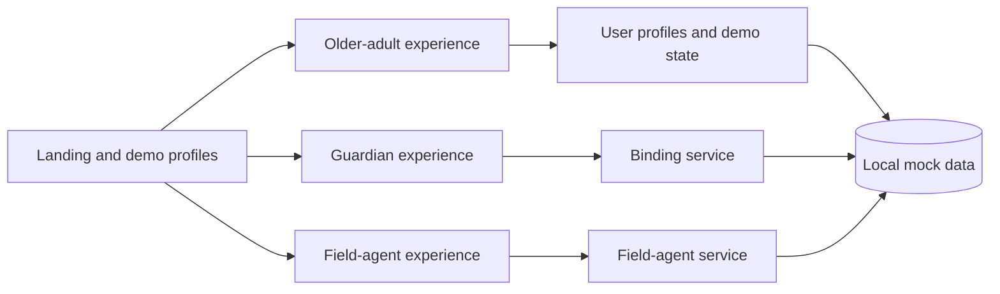

# JagaID

> An inclusive digital identity access prototype for older adults, trusted guardians, and field agents.

**Hackathon result:** Top 9, Inclusivity Track — GodamLah 2.0 Smart ID Hackathon

**Project type:** Three-person, AI-assisted Flutter hackathon prototype

> **Prototype boundary:** JagaID demonstrates user journeys with local mock data and scripted interactions. It does not connect to MyDigital ID, government systems, NFC hardware, a camera-based QR scanner, a production backend, or a live AI model.

## Overview

JagaID explores how digital identity services could be more approachable for older adults and people in connectivity-constrained communities. Instead of designing a single interface for every user, the prototype separates three complementary experiences:

- an accessibility-aware experience for older adults;
- a consent-based guardian and delegation flow; and
- a field-agent workflow for assisted, in-person service delivery.

The project was built under hackathon time constraints, with the emphasis on inclusive product thinking, rapid prototyping, and demonstrating complete user journeys.

## Prototype flows

| Experience | What the prototype demonstrates |
| --- | --- |
| Older adult | Accessibility profiles, English/Malay/Chinese interface states, proactive renewal reminders, guardian authorization, and scripted “Ghost Typing” form assistance |
| Guardian/delegate | Dependent selection, authorization requests, manual form completion, and simulated NFC/QR binding journeys |
| Field agent | Mock roster synchronisation, search and filtering, simulated NFC identity verification, villager profiles, and transaction tracking |

## Architecture



The Flutter application is organised into screen, model, service, and shared-state layers. `BindingService` models the guardian/senior pairing journey, while `FieldAgentService` provides an in-memory roster and simulated transactions. This keeps the prototype easy to demonstrate without presenting the mock services as production infrastructure.

## Implementation status

| Concept | Current implementation | Production boundary |
| --- | --- | --- |
| MyDigital ID login | Scripted loading and navigation flow | No external authentication or official integration |
| NFC access and verification | Tap-driven simulation with mock identity data | No NFC plugin, secure element, or PKI implementation |
| QR binding | In-memory request lifecycle and visual QR-style pattern | No camera scanning or cryptographic validation |
| AI Ghost Typing | Scripted form-filling animation | No live AI model or personal-data processing |
| Field operations | Mock villagers, profiles, and transactions | No backend, offline synchronisation, or government data |

## My contributions

Git history records **22 commits** by [Ti Jia Don](https://github.com/cloudnine-ddy). My work included:

- implementing and refining the older-adult experience, accessibility profiles, multilingual states, and responsive UI;
- building the proactive renewal notification and scripted Ghost Typing form flow;
- implementing the guardian/delegate journey, authorization state, binding UX, and manual guardian mode;
- building Field Agent Mode, including the dashboard, villager profiles, transaction models, and mock service layer; and
- integrating navigation across the role-based flows and resolving layout/interaction issues during the hackathon.

## Team and development approach

JagaID was created by a three-person team:

- [Ti Jia Don](https://github.com/cloudnine-ddy)
- [Brandon Tay](https://github.com/BrandonTay1007)
- Tay Wei Yong

The repository was also an experiment in AI-assisted rapid prototyping. Generative AI was used as an implementation copilot, while the team selected the product direction, shaped the user journeys, reviewed and adapted the generated code, integrated the flows, and made the final design decisions. The “AI Ghost Typing” shown inside the app is a scripted prototype interaction, not evidence of a deployed AI service.

## Tech stack

- Flutter and Dart
- Material Design 3
- Google Fonts
- In-memory Dart models and services

## Getting started

### Prerequisites

- Flutter stable with Dart `>=3.10.1 <4.0.0`
- Chrome, Android Studio, or another Flutter-supported target
- Windows Developer Mode when Flutter requests plugin symlink support

### Run locally

```bash
git clone https://github.com/cloudnine-ddy/jagaid.git
cd jagaid/app
flutter pub get
flutter run -d chrome
```

### Quality checks

```bash
cd app
flutter analyze
flutter build web
```

The web production build was verified successfully on 25 August 2026 using Flutter 3.38.5 and Dart 3.10.4.

## Project structure

```text
jagaid/
├── app/
│   ├── lib/
│   │   ├── main.dart
│   │   ├── models/
│   │   ├── screens/
│   │   │   └── field_agent/
│   │   ├── services/
│   │   └── utils/
│   └── pubspec.yaml
└── README.md
```

## Current limitations

- All identities, profiles, binding requests, transactions, and service data are local mock data.
- The prototype has no production authentication, backend, database, encryption, audit logging, or offline synchronisation.
- NFC, QR scanning, MyDigital ID, and AI-assisted form filling are simulated UX concepts rather than live integrations.
- Automated tests have not been added. `flutter analyze` currently reports existing warning/information debt, primarily Flutter API deprecations plus a small number of unused-code and async-context findings.
- The prototype has not undergone security, privacy, accessibility, or real-user validation.

## License and disclaimer

No open-source license is currently provided. All rights are reserved by the project contributors.

JagaID is an independent hackathon prototype created for demonstration and learning. It is not an official MyDigital ID or Malaysian government application, and it has not been deployed, adopted, or security-audited for real identity use.
